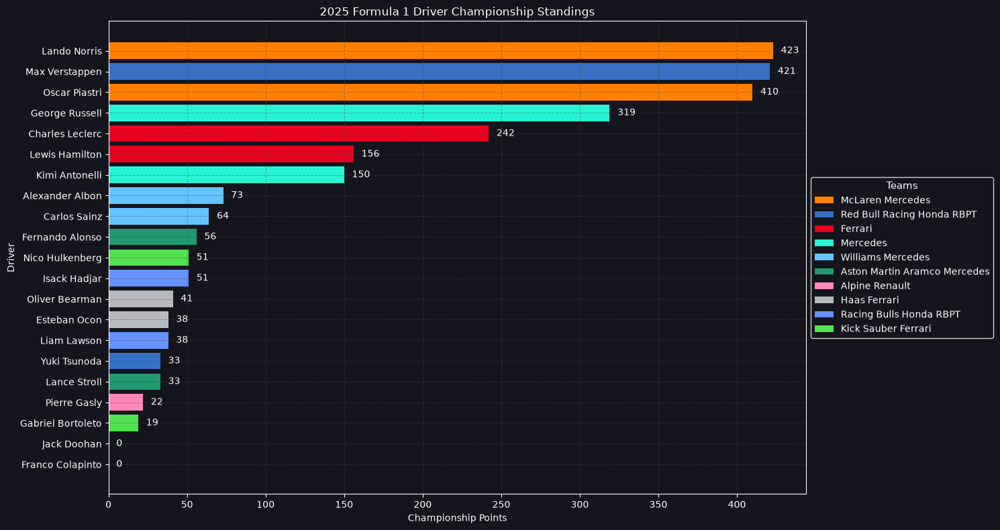
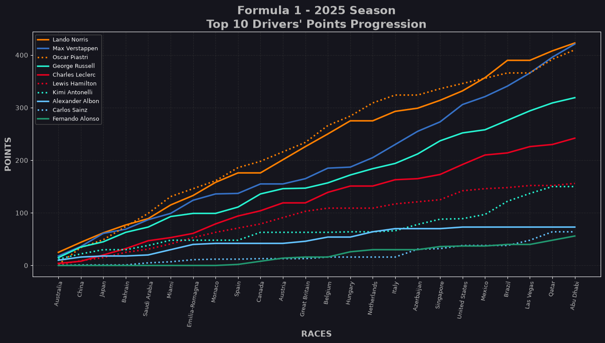
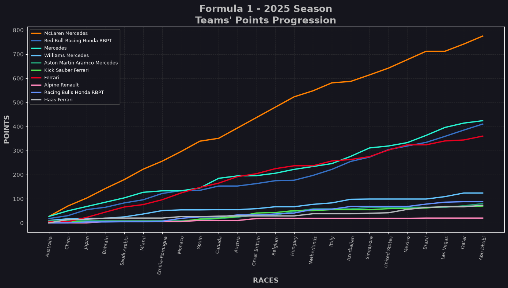
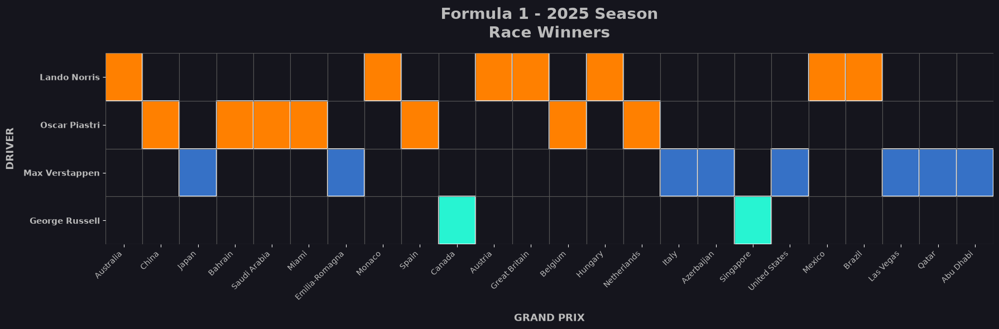
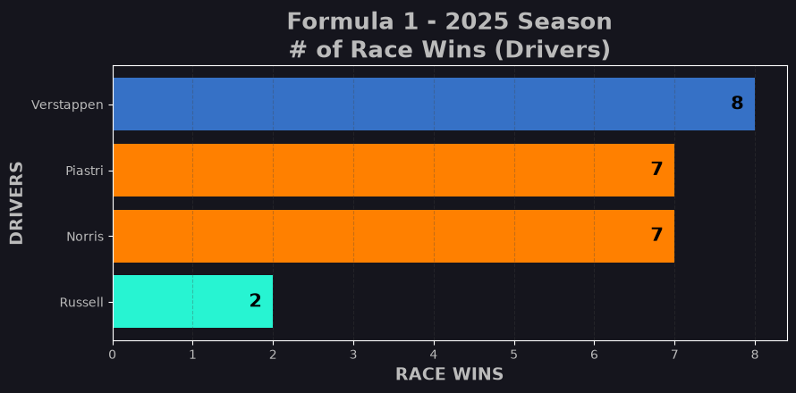
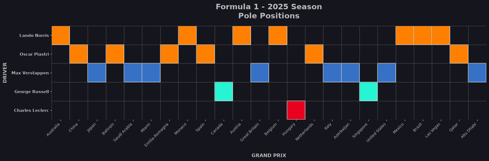
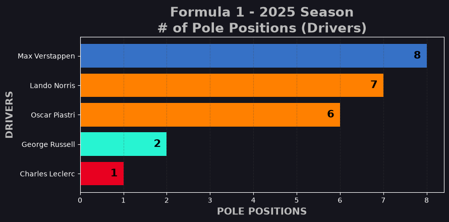
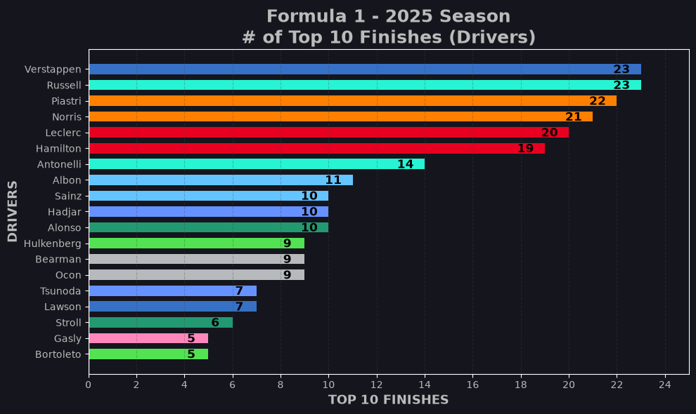
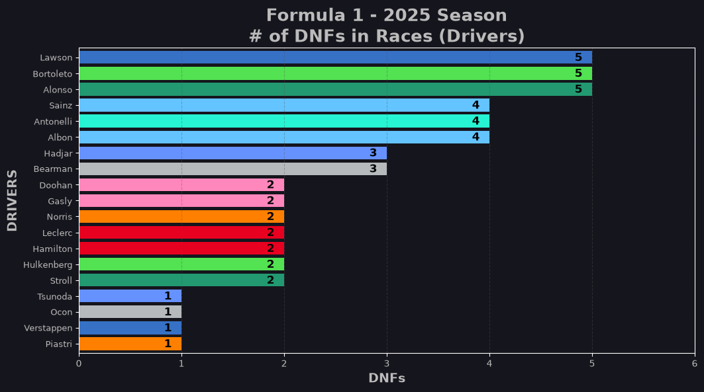

<p align="center">
  
</p>

<h1 align="center">🏎️ F1 2025 Season Analysis</h1>

<p align="center">
  An exploratory data analysis of the 2025 Formula 1 World Championship, built with Python, pandas, matplotlib and seaborn.
</p>

<p align="center">
  
  
  
  
</p>

---

## 📖 Table of Contents

- [Overview](#-overview)
- [Why This Project Matters](#-why-this-project-matters)
- [Dataset](#-dataset)
- [Questions Answered](#-questions-answered)
- [Analysis and Findings](#-analysis-and-findings)
- [Key Takeaways](#-key-takeaways)
- [Methodology](#-methodology)
- [Project Structure](#-project-structure)
- [Getting Started](#-getting-started)
- [Tech Stack](#-tech-stack)
- [Future Improvements](#-future-improvements)
- [Acknowledgements and License](#-acknowledgements-and-license)
- [Author](#-author)

---

## 🔍 Overview

The 2025 Formula 1 season produced a very tight title fight. Across **24 Grands Prix** and **6 sprint events**, three drivers (two of them teammates at McLaren) battled for the championship until the very end.

This project takes raw season data (race calendar, teams, drivers, qualifying, sprint and race results) and turns it into a clear story using data cleaning, aggregation and visualization. Every chart is drawn in a dark, F1-inspired theme, with **official team colours** so each driver and constructor is instantly recognisable.

The full analysis lives in [`F1-2025_Analysis.ipynb`](F1-2025_Analysis.ipynb). A static export is available as [`F1-2025_Analysis.html`](F1-2025_Analysis.html) if you just want to read it without running anything.

---


## 🗂️ Dataset

All data is stored in the [`csv/`](csv) folder:

| File | What it contains |
|------|------------------|
| `Formula1_2025Season_Calendar.csv` | 24 rounds: date, GP name, circuit, city, laps, circuit length, race distance, lap record, turns, DRS zones |
| `Formula1_2025Season_Teams.csv` | The 10 teams: base, team principal, technical chief, chassis, power unit, historical records |
| `Formula1_2025Season_Drivers.csv` | The 2025 driver line-up: number, team, nationality, career points, podiums, poles, titles, DNFs, birth details |
| `Formula1_2025Season_QualifyingResults.csv` | Qualifying classification for every Grand Prix |
| `Formula1_2025Season_SprintQualifyingResults.csv` | Sprint qualifying classification |
| `Formula1_2025Season_SprintResults.csv` | Results and points from the sprint races |
| `Formula1_2025Season_RaceResults.csv` | Race classification: grid slot, laps, time or retirement, points, fastest lap |
| `Formula1_2025Season_DriverOfTheDayVotes.csv` | Fan "Driver of the Day" voting per race |

> **Data source:** The datasets come from [toUpperCase78/formula1-datasets](https://github.com/toUpperCase78/formula1-datasets) by Dogan Yigit Yenigun, a public repository of Formula 1 season datasets, licensed under GPL-3.0. Many thanks to the author for maintaining it.

---

## ❓ Questions Answered

1. Who won the 2025 Drivers' and Constructors' Championships, and by what margin?
2. How did the title fight develop race by race?
3. Which drivers and teams won the most races and took the most pole positions?
4. Who was the most consistent point-scorer?
5. Whose season was hurt most by retirements?
6. How did the circuits on the calendar differ?

---

## 📊 Analysis and Findings

### 1. Drivers' Championship

Race points and sprint points are combined to build the final standings.



| Pos | Driver | Team | Points |
|:---:|--------|------|-------:|
| 1 | Lando Norris | McLaren | **423** |
| 2 | Max Verstappen | Red Bull Racing | **421** |
| 3 | Oscar Piastri | McLaren | **410** |
| 4 | George Russell | Mercedes | 319 |
| 5 | Charles Leclerc | Ferrari | 242 |
| 6 | Lewis Hamilton | Ferrari | 156 |
| 7 | Kimi Antonelli | Mercedes | 150 |
| 8 | Alexander Albon | Williams | 73 |
| 9 | Carlos Sainz | Williams | 64 |
| 10 | Fernando Alonso | Aston Martin | 56 |

**Findings**
- The title was decided by just **2 points** between Norris and Verstappen, with Piastri only 11 points off the lead.
- The top three finished **91 points or more** clear of Russell in 4th, so the title fight was effectively a three-way battle.
- Ferrari's two drivers finished 5th and 6th, a long way behind the leaders.

### 2. Championship Progression



Cumulative points (race plus sprint) for the top 10 drivers. Each team's first driver is a solid line and the second is dotted, so teammates are easy to compare.

**Findings**
- **Piastri led the championship for most of the first half of the season**, with Norris close behind and Verstappen trailing both of them.
- Norris overtook his teammate in the second half and held the lead from there to the finish.
- Verstappen was far behind in mid-season, then **surged in the final third** with a run of strong results. He passed Piastri and finished just 2 points short of Norris.
- Russell and Leclerc stayed steadily in 4th and 5th, while Hamilton and Antonelli finished the season level at around 150 points.
- The chart shows that the title was decided over the whole season, not by a single race.

### 3. Constructors' Championship



| Pos | Team | Points |
|:---:|------|-------:|
| 1 | McLaren Mercedes | **833** |
| 2 | Mercedes | 469 |
| 3 | Red Bull Racing Honda RBPT | 451 |
| 4 | Ferrari | 398 |
| 5 | Williams Mercedes | 137 |
| 6 | Racing Bulls Honda RBPT | 92 |
| 7 | Aston Martin Aramco Mercedes | 89 |
| 8 | Haas Ferrari | 79 |
| 9 | Kick Sauber Ferrari | 70 |
| 10 | Alpine Renault | 22 |

**Findings**
- McLaren scored **364 points more** than second-placed Mercedes, which is roughly **1.8 times** the next team's total.
- That dominance came from having **two** drivers who both finished in the championship top three.
- Mercedes, Red Bull and Ferrari were separated by only 71 points, so the fight for 2nd to 4th was tight.
- Red Bull's total depended heavily on one driver (Verstappen), while McLaren's was spread evenly.
- Alpine finished last on 22 points.

### 4. Race Winners




| Driver | Team | Wins |
|--------|------|:----:|
| Max Verstappen | Red Bull | **8** |
| Lando Norris | McLaren | 7 |
| Oscar Piastri | McLaren | 7 |
| George Russell | Mercedes | 2 |

**Findings**
- Only **four drivers** won a race all season.
- McLaren won **14 of 24** races, but split them evenly between its two drivers (7 each), so they took points off each other.
- Verstappen won the most races (8) yet finished second, which shows that wins alone do not decide a championship.
- Ferrari did not win a single Grand Prix.

### 5. Pole Positions




| Driver | Team | Poles |
|--------|------|:-----:|
| Max Verstappen | Red Bull | **8** |
| Lando Norris | McLaren | 7 |
| Oscar Piastri | McLaren | 6 |
| George Russell | Mercedes | 2 |
| Charles Leclerc | Ferrari | 1 |

**Findings**
- Verstappen led qualifying with 8 poles, matching his win count, and converted 5 of those poles into wins.
- McLaren took **13 poles** in total, showing strong one-lap pace.
- Leclerc's pole in Hungary was Ferrari's only one of the season.

### 6. Consistency: Points-Scoring Finishes



**Findings**
- Verstappen and Russell tied for the most top-10 finishes, with **23 out of 24 races**.
- Piastri (22) and Norris (21) were also very consistent, and Leclerc (20) and Hamilton (19) were not far behind.
- Rookie Antonelli scored in 14 races, a solid result for a first season.

### 7. Reliability and Retirements (DNFs)



**Findings**
- **Lawson, Bortoleto and Alonso** had the most retirements, with 5 each.
- **Sainz, Antonelli and Albon** each retired 4 times.
- Verstappen and Piastri retired only **once** each, which supports their high finishing consistency.
- Norris, Leclerc and Hamilton each retired twice.

---

## 🏁 Key Takeaways

1. **A razor-thin title fight.** Two points separated 1st and 2nd, and three drivers were in contention at the end.
2. **McLaren had the fastest package** (833 points and 13 poles), but having two title contenders meant they shared the wins.
3. **Wins alone did not decide the title.** Verstappen won more races (8 vs 7) and took more poles (8 vs 7) than Norris, yet finished 2 points behind, because Norris added points more steadily across the season.
4. **Reliability shaped the season.** Drivers with fewer than two retirements finished far higher than those who often failed to finish.
5. **The midfield was far behind.** The gap from 4th to 5th in the Constructors' standings was over 250 points.

---

## 🧪 Methodology

1. **Load** all CSV files with pandas and set meaningful indexes (round, driver abbreviation, track).
2. **Aggregate** race points and sprint points per driver and per team, filling missing values with zero for drivers who missed sprint events.
3. **Build standings** by combining both sources and sorting by points.
4. **Map each driver to their team** and each team to its official colour.
5. **Compute cumulative points** race by race, adding sprint points to the correct Grand Prix weekend.
6. **Filter and count** race winners, pole sitters, top-10 finishes and DNFs.
7. **Visualize** with matplotlib using a custom dark theme, team colours and annotated bars.

---

## 📁 Project Structure

```
F1-2025_Analysis/
├── csv/
│   ├── Formula1_2025Season_Calendar.csv
│   ├── Formula1_2025Season_DriverOfTheDayVotes.csv
│   ├── Formula1_2025Season_Drivers.csv
│   ├── Formula1_2025Season_QualifyingResults.csv
│   ├── Formula1_2025Season_RaceResults.csv
│   ├── Formula1_2025Season_SprintQualifyingResults.csv
│   ├── Formula1_2025Season_SprintResults.csv
│   └── Formula1_2025Season_Teams.csv
├── images/                   # Charts used in this README
├── F1-2025_Analysis.ipynb    # Main notebook
├── F1-2025_Analysis.html     # Static export of the notebook
├── requirements.txt
└── README.md
```

---


## 🛠️ Tech Stack

| Tool | Purpose |
|------|---------|
| **Python** | Core language |
| **pandas** | Data loading, grouping and aggregation |
| **NumPy** | Cumulative sums and array operations |
| **matplotlib** | Custom charts and styling |
| **seaborn** | Statistical plotting support |
| **Jupyter / VS Code** | Interactive analysis environment |

---

## 🔮 Future Improvements

- Analyse the **Driver of the Day** votes, which are loaded but not yet visualised.
- Compare **qualifying position vs finishing position** to measure overtaking and race pace.
- Add **sprint-specific** analysis (sprint winners and sprint points per team).
- Study **teammate head-to-head** records (qualifying and race).
- Build an **interactive dashboard** with Plotly or Streamlit.
- Add **fastest-lap** and **pit-stop** analysis if the data becomes available.

---

## 🙏 Acknowledgements and License

- **Data:** [toUpperCase78/formula1-datasets](https://github.com/toUpperCase78/formula1-datasets), licensed under [GPL-3.0](https://github.com/toUpperCase78/formula1-datasets/blob/master/LICENSE). The CSV files in the `csv/` folder were downloaded from that repository.

---

## 👤 Author

**Sajana Yemitha**
- GitHub: [@sajanayemitha](https://github.com/sajanayemitha)
- LinkedIn: (https://www.linkedin.com/in/sajana-yemitha)

If you found this project useful, consider giving it a ⭐!

---

<sub>This is an unofficial fan project for educational purposes. Formula 1 and related marks are trademarks of Formula One Licensing BV. This project is not affiliated with or endorsed by Formula 1.</sub>
